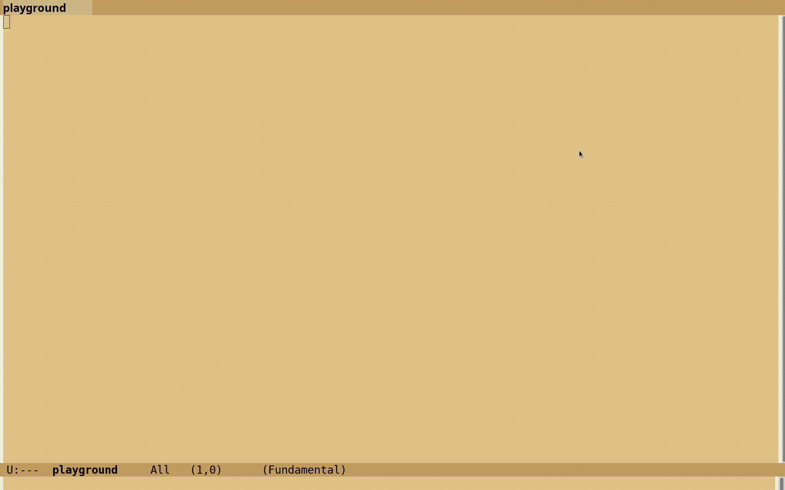

# 2windows.el
Convenient 2 window creation and reorientation system for GNU Emacs.

## Dependencies
1. [Install GNU Emacs](https://www.gnu.org/software/emacs/).
2. [Install ace-window in GNU Emacs](https://elpa.gnu.org/packages/ace-window.html).

## Setup
1. Add the following to your emacs Initialization File:
   ```elisp
   (setq 2windows-file "/path/to/2windows.el")
   (if (file-exists-p 2windows-file)
       (progn (load 2windows-file)
              (global-set-key (kbd "C-2") 'sgang-2windows)))
   ```
2. Optional: change the `C-2` above to any key that you like.

## Usage

Assuming that `sgang-2windows` is bound to `C-2` we have the following:

1. If there is only 1 window, then pressing `C-2` results in the creation of a
   new window on the right while the currently selected window stays selected
   on the left.
2. If there are 2 windows, then each time `C-2` is pressed, the same 2 windows
   are maintained but they are reoriented while keeping the same window selected.
   Successive presses of `C-2` make the selected window cyclically go through the
   following sequence of orientations: `left -> top -> bottom -> right -> left`.
3. If there are more than 2 windows, then upon pressing `C-2` the user is asked to
   select 2 windows using numerical hints provided by `ace-window`. All other
   windows are deleted, and the 2 chosen windows are (re)oriented vertically,
   with the window that was chosen first being selected (focused) and positioned
   on the left. The 2 selected windows are allowed to be the same.


